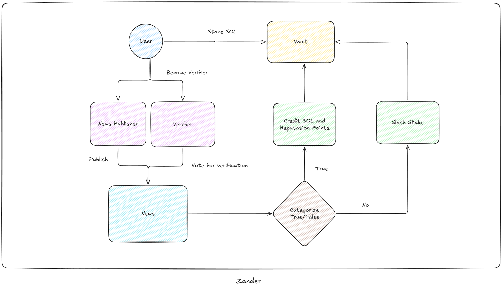
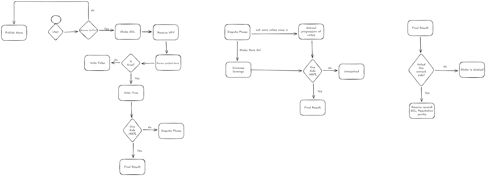

# Zander

Zander is a decentralized news verification network built on Solana. It empowers users to verify news transparently and collaboratively, ensuring trust in an era of misinformation. By leveraging blockchain technology, Zander provides an immutable, community-driven platform for truth verification.

## User Story

[Click Here](./UserStory.md) to see user story

## Architecture Diagram




## Features

- **Transparent News Verification**: Users can search and verify news items with on-chain data.
- **Immutable Publishing**: Anyone can publish news with verifiable proof of authenticity.
- **Stake-Backed Voting**: Fact-checkers evaluate news and cast votes backed by staked SOL.
- **Incentivized Accuracy**: Verifiers earn rewards for accurate votes and face penalties for inaccuracies.
- **Community-Driven Truth**: Truth emerges from collective consensus, not centralized entities.

## Getting Started

### Prerequisites

- Rust
- Anchor Framework
- Solana CLI
- Node.js

### Installation

1. Clone the repository:
```bash
git clone https://github.com/Bijoy99roy/zander
cd zander
```

2. Install dependencies:
```bash
npm install
```

3. Build the Solana program:
```bash
anchor build
```

4. Test the program:
```bash
anchor test
```

5. Deploy the program:
```bash
anchor deploy
```

